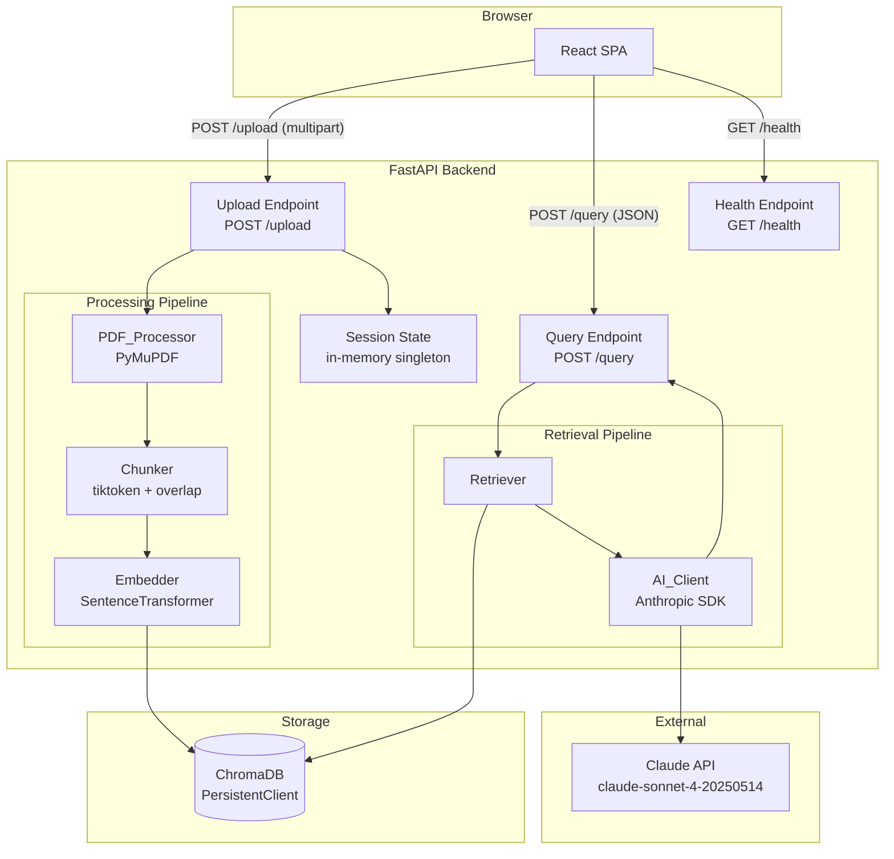
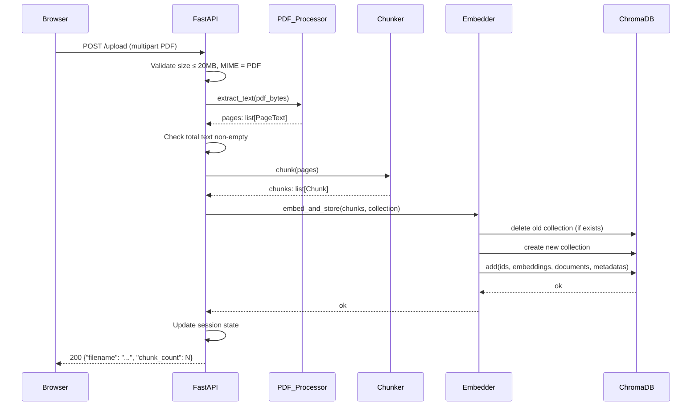
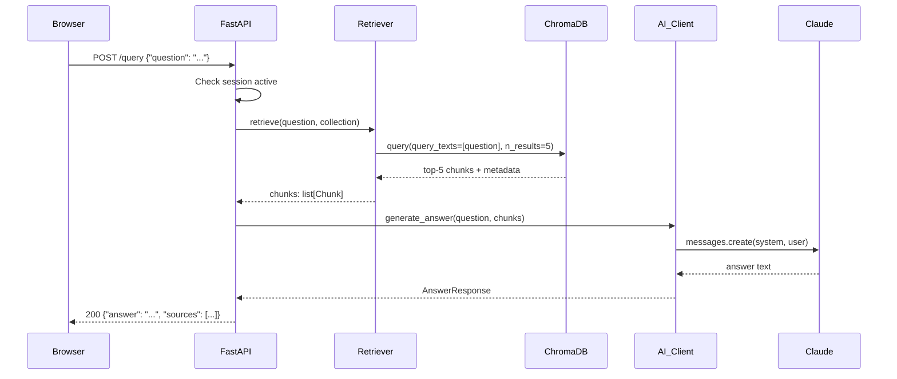

# Design Document: AI Second Brain

## Overview

The AI Second Brain is a Retrieval-Augmented Generation (RAG) application that lets a user upload a single PDF and ask natural language questions about it. The system extracts text from the PDF, splits it into overlapping token-based chunks, embeds those chunks into a ChromaDB vector store, and uses Claude (`claude-sonnet-4-20250514`) to generate answers grounded exclusively in the retrieved document context.

The architecture is a two-tier web application:

- **Frontend**: React + Vite SPA served statically, communicating with the backend over HTTP.
- **Backend**: Python + FastAPI server that owns all processing logic — PDF ingestion, chunking, embedding, retrieval, and AI answer generation.

The system is intentionally minimal: one active session at a time, one PDF at a time, no user accounts, no persistent history across server restarts.

### Key Design Decisions

| Decision | Choice | Rationale |
|---|---|---|
| PDF extraction library | PyMuPDF (`fitz`) | Page-level text extraction with metadata; handles most PDF types reliably |
| Embedding model | `all-MiniLM-L6-v2` via `sentence-transformers` | Runs locally (no API cost), ChromaDB has a built-in wrapper, good quality for semantic search |
| Chunking strategy | Token-based fixed-size with overlap | Predictable chunk sizes; `tiktoken` counts tokens accurately for the embedding model |
| Vector store | ChromaDB `PersistentClient` | Persists across requests within the server process; simple collection lifecycle API |
| Session isolation | Single named collection, replaced on new upload | Keeps the design simple; no multi-user isolation needed |
| AI model | `claude-sonnet-4-20250514` | Specified in requirements; strong instruction-following for grounded RAG prompts |

---

## Architecture



### Request Flow: PDF Upload



### Request Flow: Question Answering



---

## Components and Interfaces

### Backend Components

#### `PDF_Processor`

Responsible for extracting text from a PDF byte stream, preserving page boundaries.

```python
@dataclass
class PageText:
    page_number: int   # 1-indexed
    text: str

def extract_text(pdf_bytes: bytes) -> list[PageText]:
    """
    Opens the PDF from bytes using PyMuPDF.
    Returns one PageText per page.
    Raises ValueError if no text is extractable.
    """
```

**Implementation notes:**
- Use `fitz.open(stream=pdf_bytes, filetype="pdf")` to open from memory.
- Call `page.get_text("text")` for each page.
- Strip whitespace; skip pages with no text but do not fail on them.
- If the total extracted text across all pages is empty, raise `ValueError("No extractable text found in the uploaded PDF.")`.

#### `Chunker`

Splits a list of `PageText` objects into overlapping token-based chunks with metadata.

```python
@dataclass
class Chunk:
    id: str              # UUID
    text: str
    source_file: str
    page_numbers: list[int]   # pages this chunk spans

def chunk_pages(
    pages: list[PageText],
    source_file: str,
    chunk_size: int = 500,
    overlap: int = 50,
) -> list[Chunk]:
    """
    Concatenates page text with page markers, then splits into
    token-based chunks of `chunk_size` tokens with `overlap` token overlap.
    Each chunk carries the page number(s) it originated from.
    """
```

**Implementation notes:**
- Use `tiktoken` with the `cl100k_base` encoding (compatible with most modern models) to count tokens.
- Maintain a sliding window: advance by `chunk_size - overlap` tokens per step.
- Track which page(s) each token window spans by keeping a token-to-page mapping built during concatenation.
- Assign a UUID to each chunk for stable ChromaDB IDs.

#### `Embedder`

Generates embeddings and stores chunks in ChromaDB.

```python
COLLECTION_NAME = "active_session"

def embed_and_store(
    chunks: list[Chunk],
    chroma_client: chromadb.PersistentClient,
) -> None:
    """
    Deletes the existing 'active_session' collection if present,
    creates a fresh one with SentenceTransformerEmbeddingFunction,
    and adds all chunks.
    """
```

**Implementation notes:**
- Use `chromadb.utils.embedding_functions.SentenceTransformerEmbeddingFunction(model_name="all-MiniLM-L6-v2")`.
- ChromaDB will compute embeddings automatically when `documents` are passed to `collection.add()`.
- Pass `metadatas=[{"source_file": c.source_file, "page_numbers": str(c.page_numbers)} for c in chunks]`.
- Wrap in a try/except; re-raise as `RuntimeError` on failure so the endpoint returns HTTP 500.

#### `Retriever`

Queries ChromaDB for the top-k most relevant chunks.

```python
def retrieve(
    question: str,
    chroma_client: chromadb.PersistentClient,
    n_results: int = 5,
) -> list[Chunk]:
    """
    Embeds the question using the same SentenceTransformer model,
    queries the active_session collection, and returns the top-n chunks.
    Raises LookupError if no active session collection exists.
    """
```

**Implementation notes:**
- Use `collection.query(query_texts=[question], n_results=n_results)`.
- ChromaDB uses the collection's embedding function to embed the query automatically, ensuring vector space consistency with the stored embeddings.
- Reconstruct `Chunk` objects from the returned `documents`, `ids`, and `metadatas`.

#### `AI_Client`

Constructs the RAG prompt and calls the Claude API.

```python
@dataclass
class AnswerResponse:
    answer: str
    sources: list[SourceAttribution]

@dataclass
class SourceAttribution:
    source_file: str
    page_numbers: list[int]

def generate_answer(
    question: str,
    chunks: list[Chunk],
    anthropic_client: anthropic.Anthropic,
) -> AnswerResponse:
    """
    Builds a system prompt instructing Claude to answer only from context,
    formats retrieved chunks as the context block,
    calls claude-sonnet-4-20250514, and returns the answer with source metadata.
    """
```

**Prompt structure:**

```
SYSTEM:
You are a document assistant. Answer the user's question using ONLY the
context passages provided below. If the context does not contain enough
information to answer the question, respond with exactly:
"I could not find an answer to that question in the uploaded document."
Do not use any knowledge outside the provided context.

USER:
Context:
---
[Passage 1 — source: filename.pdf, pages: [3]]
<chunk text>

[Passage 2 — source: filename.pdf, pages: [3, 4]]
<chunk text>
...
---

Question: <user question>
```

**Implementation notes:**
- Use `anthropic.Anthropic()` client (reads `ANTHROPIC_API_KEY` from environment).
- Call `client.messages.create(model="claude-sonnet-4-20250514", max_tokens=1024, system=..., messages=[{"role": "user", "content": ...}])`.
- Deduplicate sources by `(source_file, page_numbers)` before returning.
- Catch `anthropic.APIError` and re-raise as `RuntimeError("AI service unavailable.")`.

### FastAPI Endpoints

#### `POST /upload`

```
Request:  multipart/form-data  { file: <PDF binary> }
Response 200: { "filename": str, "chunk_count": int }
Response 422: { "detail": str }   # validation errors
Response 500: { "detail": str }   # embedding failure
```

Validation order:
1. Content-type header contains `application/pdf` or filename ends with `.pdf`.
2. File size ≤ 20 MB (checked after reading into memory).
3. Text extraction succeeds (non-empty).

#### `POST /query`

```
Request:  application/json  { "question": str }
Response 200: {
  "answer": str,
  "sources": [{ "source_file": str, "page_numbers": [int] }]
}
Response 400: { "detail": "No document loaded. Please upload a PDF first." }
Response 502: { "detail": "AI service unavailable. Please try again." }
```

#### `GET /health`

```
Response 200: { "status": "ok" }
Response 503: { "status": "degraded", "detail": "ChromaDB unreachable" }
```

### Session State

A module-level singleton in the FastAPI app holds the active session:

```python
@dataclass
class SessionState:
    active: bool = False
    filename: str | None = None
    chunk_count: int = 0
```

This is reset on each successful upload and read on each query. It is intentionally in-process (not persisted to disk), satisfying Requirement 8.4 ("within the same server process lifetime").

### Frontend Components

```
src/
  App.jsx                  # Root layout, session state provider
  components/
    UploadPanel.jsx         # File picker, upload button, status display
    ChatPanel.jsx           # Conversation history + question input
    MessageBubble.jsx       # Single message (user or AI) with source attribution
    SourceBadge.jsx         # Displays "filename.pdf · p. 3–4"
    LoadingSpinner.jsx      # Reusable spinner
  hooks/
    useSession.js           # Session state (filename, uploadStatus)
    useChat.js              # Conversation history, send question
  api/
    client.js               # fetch wrappers for /upload, /query, /health
```

**State management**: React `useState` + `useContext` (no external state library needed for this scope).

**Markdown rendering**: Use `react-markdown` for rendering AI answer text with bold, italic, and list support.

---

## Data Models

### Backend (Python dataclasses / Pydantic)

```python
# Pydantic models for API I/O
class QueryRequest(BaseModel):
    question: str

class SourceAttribution(BaseModel):
    source_file: str
    page_numbers: list[int]

class QueryResponse(BaseModel):
    answer: str
    sources: list[SourceAttribution]

class UploadResponse(BaseModel):
    filename: str
    chunk_count: int

class HealthResponse(BaseModel):
    status: str
    detail: str | None = None

# Internal dataclasses
@dataclass
class PageText:
    page_number: int
    text: str

@dataclass
class Chunk:
    id: str
    text: str
    source_file: str
    page_numbers: list[int]
```

### ChromaDB Document Schema

Each document stored in the `active_session` collection:

| Field | Type | Description |
|---|---|---|
| `id` | `str` (UUID) | Unique chunk identifier |
| `document` | `str` | Raw chunk text |
| `embedding` | `list[float]` | 384-dim vector from `all-MiniLM-L6-v2` |
| `metadata.source_file` | `str` | Original PDF filename |
| `metadata.page_numbers` | `str` | JSON-serialized list of ints, e.g. `"[3, 4]"` |

> ChromaDB metadata values must be scalar types; `page_numbers` is stored as a JSON string and parsed on retrieval.

### Frontend State Shape

```javascript
// Session context
{
  filename: string | null,       // currently loaded PDF name
  uploadStatus: 'idle' | 'uploading' | 'success' | 'error',
  uploadError: string | null,
}

// Chat context
{
  messages: [
    {
      id: string,
      role: 'user' | 'assistant',
      content: string,
      sources: [{ source_file: string, page_numbers: number[] }] | null,
      isError: boolean,
    }
  ],
  isLoading: boolean,
}
```

---

## Correctness Properties

*A property is a characteristic or behavior that should hold true across all valid executions of a system — essentially, a formal statement about what the system should do. Properties serve as the bridge between human-readable specifications and machine-verifiable correctness guarantees.*

